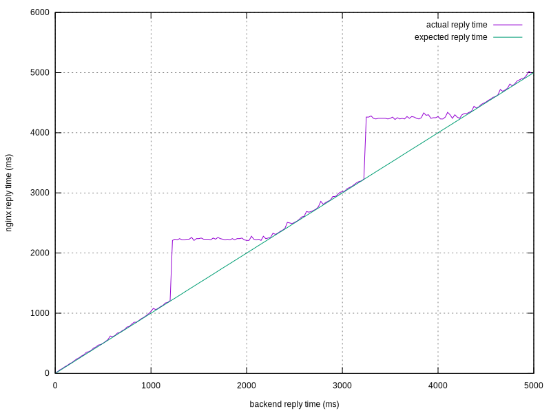

# nginx backend delay bug

I've experienced strange behavior of nginx with slow uwsgi backend:
if the backend replies in more than around 1.2 seconds, nginx introduces
additional delay, so total reply time raises up to around 2.2 seconds.

A graph of nginx reply time vs. backend reply time demonstrates this
in a more visual way:



## Repository contents

This repository contains a setup which reliably reproduces the
problem for me. It consists of a simple HTTPish backed simulator
which replies in 0.5 and 1.5 seconds interchangeably, an nginx
config which uses the backend and a script which runs everything.

## Expected behavior

Obviously, nginx should not add any additional delay over the backend,
so since backend replies in 0.5 seconds and then in 1.5 seconds, nginx
should reply in around the same time.

## Actual behavior

In practice, however, this happens:

```
===> Compiling backend simulator
===> Running backend simulator
===> Running nginx
===> Waiting 1 sec for everybody to start
===> Trying request
/!\ First request: backend replies in 0.5 seconds
        0,52 real         0,01 user         0,00 sys
/!\ Second request: backend replies in 1.5 seconds
        2,23 real         0,00 user         0,00 sys
/!\ If you're seeing more than 2 seconds here, you're experiencing nginx problem
===> Shutting everything down
```

Note that the second response comes with 2.23 seconds instead of expected 1.52 or so.

## Enviroment

- OS
  - FreeBSD 11.2-RELEASE-p1 amd64
  - FreeBSD 12.0-CURRENT amd64 (from Jun 2017)`
- nginx
  - 1.15.4
  - 1.15.5

## Contacts

- Dmitry Marakasov <amdmi3@amdmi3.ru>
